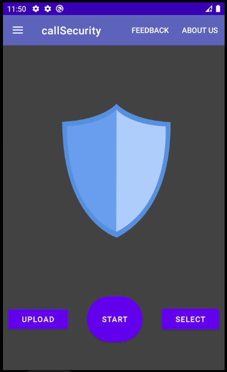
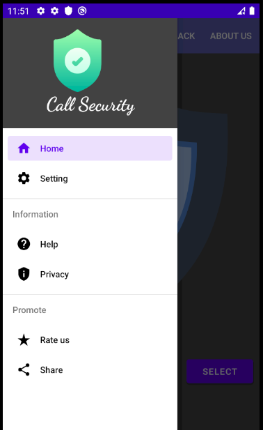
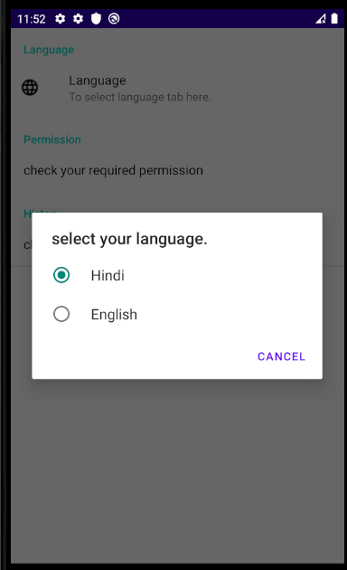
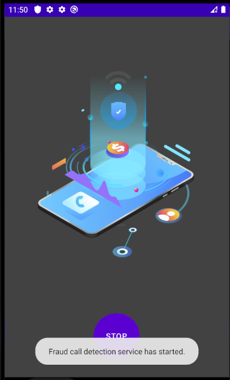

# fraud-call-detection-app

Now a days every people have faced scam or fraud call problem,
where the scammer try to ask the user for his confidential information 
such as (OTP message, Bank Account number, Credit Card number ).
There are few way to stop such type scam or fraud call activity
one of them is app, which is classify the call either it is fraud
or normal call. 


## Roadmap

- Requirement Analysis :
    Gathering fraud and normal call data from internet,

- Speech Recognition: 
    translate voice to text data.

- Natural Language Processing: 
    Process text data through nltk library.

- Machine Learning Classification Model:
    apply classification model for classify call.

- Android Application:
    Bind the machine learning classification model with android
    applicaton.


  
## Documentation

[Documentation](https://linktodocumentation)

  
## Screenshots





  
## Installation

To create machine learning classification model we need some 
dependecies such as Python interpreter, sklearn, nltk, pandas
, numpy and  matplotlib library.
First install Python from 
[Python Official Site](https://www.python.org) and rest of dependecies
install with commands.

- Create a Virtual Environment.
```bash
  pip install virtualenv
  python3 -m venv name
```
In the above command **name** is environment name.

- Activate Virtual Environment.
```bash
name\Scripts\activate
or
name\Scripts\activate.bat
```

- Install all dependecies
```bash
pip install sklearn
pip install pandas,numpy,matplotlib
```
- download nltk
```bash
pip install nltk
```
```bash
#open python shell on command prompt and run below code.
import nltk
print(nltk.download())
```
After running above code a pop-up window will be open for download nltk, click on **Download**

## References
- [Article](https://cybersecurity.springeropen.com/articles/10.1186/s42400-018-0008-5)
- [Speech Recognition](https://www.geeksforgeeks.org/speech-recognition-in-python-using-google-speech-api/)
- [Model](https://www.youtube.com/watch?v=K1iImrm509A)
- [Record Call](https://stackoverflow.com/questions/18887636/how-to-record-phone-calls-in-android)
- [Android Notification](https://developer.android.com/trianing/notify-user/build-notification)
    

  
